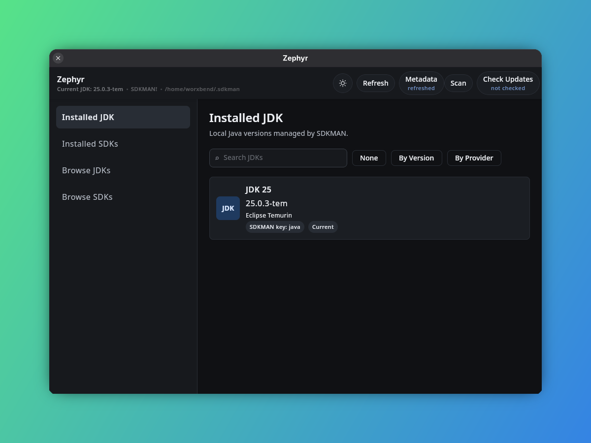
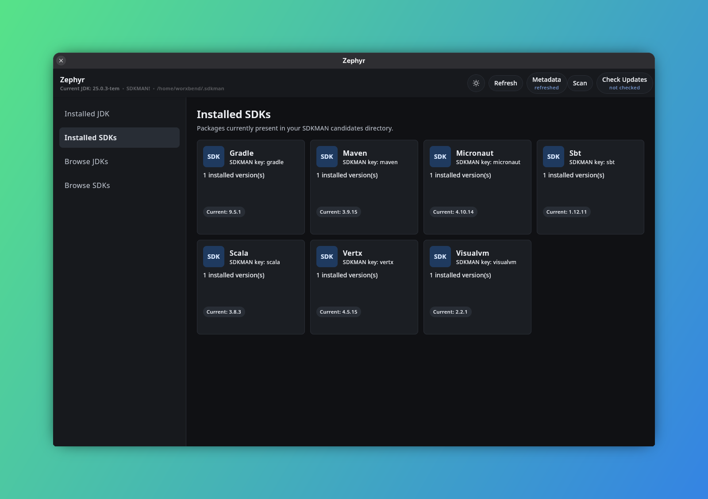
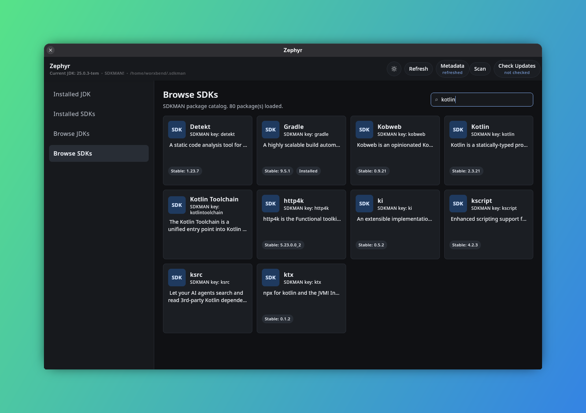

# Zephyr

A desktop GUI for [SDKMAN](https://sdkman.io/) built with Kotlin Multiplatform and Compose Desktop.
Zephyr wraps the SDKMAN CLI and local filesystem — it does not reimplement package management.

---

## The Idea

SDKMAN is excellent for installing and switching JDKs and SDKs from the terminal. But over time it accumulates **local-only versions**: builds that are installed in `~/.sdkman/candidates/` but are no longer listed in SDKMAN's remote registry.

This happens when:

- A distribution vendor pulls a specific build from the catalog.
- A version identifier changes upstream (a patch release gets replaced).
- A provider is removed or renamed in SDKMAN.

These orphaned versions waste disk space, cannot be updated through `sdk upgrade`, and are only visible if you run `sdk list <candidate>` and scan the output for the `local only` marker — one candidate at a time.

**Zephyr's primary goal is to surface local-only versions across all installed candidates in one place and make cleanup safe and straightforward.**

---

## Terminology

Zephyr uses user-facing labels instead of SDKMAN's internal "candidate" term:

- The `java` candidate is always presented as **JDK**.
- All other candidates are presented as **SDKs**.
- Internal code keeps using `Candidate` because it maps directly to SDKMAN.
- Java version identifiers are shown as JDK versions: `JDK 25`, `JDK 21`, `JDK 17`.

---

## Current Functionality

### Workbench and navigation

- **Overview** — default JDK, installed-version totals, local-only risk, health checks, and quick actions.
- **Installed JDK** — locally installed Java versions.
- **Installed SDKs** — all other locally installed SDKMAN candidates.
- **Browse JDKs** — SDKMAN's remote Java catalog.
- **Browse SDKs** — all other remote SDKMAN candidates.
- **Local-Only Versions** — orphan review and an explicit rescan workflow.
- **Diagnostics** — SDKMAN installation, connectivity, integrity health, and redacted support-bundle export.
- **Operation History** — searchable session journal with timestamps, command fields, outcomes, and CSV export.
- **Settings** — persisted theme, information density, and SDKMAN-path privacy controls.
- **About** — application version, runtime integration, project links, and license.

Navigation is grouped into Workspace, Discover, Maintenance, and application sections. A compact toolbar exposes global maintenance actions, while the bottom status bar reports background work, candidate count, default JDK, and SDKMAN state.

### Global search

- Open search from the toolbar or press `Ctrl+K` on Windows/Linux and `Cmd+K` on macOS.
- Search workspace pages, installed and previously loaded catalog candidates, installed versions, settings, and maintenance actions from one field.
- Use Up/Down to select a result, Enter to open or run it, and Escape to close.
- SDKMAN mutations selected from search still use the same network preflight and typed transaction preview as their visible toolbar controls.

### Command palette

- Press `Ctrl+Shift+P` on Windows/Linux or `Cmd+Shift+P` on macOS for a command-only view.
- The palette searches workspace navigation and maintenance commands while excluding candidate and version results.
- Frequent commands also have direct shortcuts: `Ctrl/Cmd+Shift+R` refreshes local state, `Ctrl/Cmd+Shift+L` scans local-only versions, and `Ctrl/Cmd+Shift+D` opens Diagnostics.
- Command shortcuts route through the same ViewModel operations as visible controls, preserving busy-state and transaction safeguards.

### Favorites

- Favorite any SDK from Browse SDKs; favorites sort before other matching catalog results.
- In Browse JDKs, open **Favorite vendors** to switch to provider grouping, then pin or unpin a vendor from its group header.
- Favorite SDKs and JDK vendors persist with the desktop preferences and appear as direct shortcuts on Overview.
- Favorites store SDKMAN candidate keys and JDK provider codes only; they do not store machine paths or remote content.

### Recent items

- Opening a candidate detail records it in a most-recently-used list on Overview.
- The list keeps six unique SDKMAN candidate keys, moves revisited items to the front, and persists between launches.
- Recent entries resolve to JDK or SDK detail routes using current local/catalog metadata, with a safe key-based fallback.

### Update Center

- Update Center compares every installed candidate with its stable SDKMAN catalog target.
- Candidates whose stable target is not installed are grouped into JDK and SDK updates.
- Select all or individual updates, inspect candidate details, or review the next selected install.
- Every update remains an ordinary typed install transaction with network preflight, disk-impact estimate, confirmation, and journal history.
- Refreshing Update Center metadata is explicit and uses the same confirmed SDKMAN metadata transaction as the toolbar.

### Batch installs

- Select multiple Update Center targets and choose **Review selected** to create one typed batch plan.
- The preview lists every candidate/version command and combines available sibling-based disk estimates.
- Installs run strictly one at a time; a failed item does not prevent later selected items from running.
- Update Center shows pending, running, successful, and failed status per target, while the status bar reports overall progress.
- The operation journal records the full batch command list and summary outcome.

### Batch uninstall

- Batch Uninstall lists every installed version but disables selection for persisted defaults and protected pins.
- Eligible versions can be selected across candidates and reviewed in one destructive typed transaction.
- The preview lists every removal and calculates the exact combined reclaimable size.
- Removals run sequentially with pending/running/success/failure status per version, continuing after individual failures.
- Repository checks still reject protected or default versions if local state changes between selection and execution.

### Toolchain profiles

- Save the machine's current candidate defaults as a named profile such as Backend, Android, or Data.
- Profiles persist candidate/version identifiers locally and compare every target with currently installed versions.
- Each profile shows installed and missing counts plus status badges for every target.
- Applying a profile creates a reviewed batch install containing only missing versions; it does not change defaults or remove extra versions.
- Saving an existing name replaces that profile, and profiles can be deleted without changing the SDKMAN installation.

### Project toolchain import

- Choose a project `.sdkmanrc` with the native desktop file picker.
- Zephyr parses local `candidate=version` entries only; blank lines and comments are ignored.
- Duplicate, malformed, or unsafe identifiers are excluded and reported with line-specific warnings.
- The review classifies each valid target as current default, installed but requiring a default change, or requiring installation.
- Import is read-only and displays only the selected file name, not its machine-specific path.

### Project toolchain export

- Select any subset of persisted candidate defaults and export them as a project `.sdkmanrc`.
- Output is deterministic, candidate-sorted, and includes a Zephyr generator comment.
- A native save dialog chooses the destination and shows an explicit confirmation before replacing an existing file.
- Cancelling either the save dialog or overwrite confirmation leaves the filesystem unchanged.
- The success message displays only the destination file name and exported target count.

### Candidate comparison

- Compare any candidate that currently has at least two loaded versions.
- Select two or more versions; the table stays hidden until the comparison is meaningful.
- Columns cover identifier, JDK vendor, installed/default/available state, local-only status, and protection.
- Every boolean status uses explicit Yes/No text, so the comparison never relies on color alone.

### Installed JDK screen

Displays installed Java versions as cards. Supports:

- Search by identifier, feature version, or provider name.
- Grouping by **feature version** (JDK 25, JDK 21, …) or by **provider** (Eclipse Temurin, Azul Zulu, Amazon Corretto, …).
- Default marker per version card, derived from SDKMAN's persisted `current` symlink.
- Local-only marker with a **Clean** button for orphaned versions.
- **Clean** is blocked for the default version — choose another default first.

### Installed SDKs screen

Displays installed non-Java candidates as package cards. Each card shows the default version, installed version count, and a local-only marker when orphaned versions are present. Search covers display names, SDKMAN keys, and default versions.

### Browse JDKs / Browse SDKs screens

Shows the full SDKMAN remote catalog with display names, descriptions, stable versions, and install status. Search, Installed/Available filters, live result counts, adaptive grids, and guided empty states make large catalogs easier to scan. Clicking a card opens the package detail page.

### Package detail pages

- Version list merged from the local filesystem and `sdk list <candidate>` remote output.
- Each version row shows installed, default, available, and local-only status.
- Actions per version: **Install**, **Set as Default**, **Uninstall**.
- Non-default installed versions expose **Make default** directly.
- Uninstall always requires an explicit destructive-action confirmation.
- Local-only versions show a **Clean** button (blocked when the version is the default).
- JDK detail supports the same grouping and search as the Installed JDK screen.

### Local-only cleanup

- Run **Scan** from the header bar to audit every installed candidate against SDKMAN's remote registry.
- The **Local-Only Versions** screen shows all affected packages as cards with orphaned version counts.
- **Clean** removes only the flagged versions after a typed transaction preview lists every affected version.
- If every installed version of a package is orphaned, the confirmation warns that the package may disappear from Installed after cleaning.
- Partial failures are reported; cleaning continues for remaining eligible versions.

### Transaction previews

Every SDKMAN mutation is reviewed before execution:

- Install, make-default, uninstall, cleanup, metadata refresh, and SDKMAN self-update actions create a typed command plan.
- The confirmation shows the exact action, candidate, and version fields without constructing or exposing shell expressions.
- Uninstall and cleanup previews calculate exact reclaimable bytes from local version directories.
- Install previews estimate required space from the median size of installed sibling versions and clearly label the confidence and evidence.
- Current free space appears beside the estimate when the platform can measure it.
- Candidate and version identifiers are validated both when the plan is created and again at the repository boundary.
- Destructive transactions use distinct warning styling and remain cancellable.
- Confirmed transactions are recorded from start through success or failure in the session operation journal.

### Operation journal

- Search by operation, candidate, version, status, or outcome.
- Running, successful, and failed operations use explicit status language.
- Failed entries provide transaction-specific recovery steps and safe actions for refresh, rescan, diagnostics, or reviewed retry.
- Cleanup retries retain only versions that are still verified as local-only after a new scan.
- Export writes a collision-safe CSV to `~/Downloads` when available, falling back to the user home directory.
- Export content contains operation data but excludes the SDKMAN home path.

### Protected versions

- Pin any installed version from Installed JDK or a package detail page.
- Protected badges remain visible in version lists and local-only cleanup cards.
- Candidate-level cleanup automatically excludes pinned versions and explains when every local-only version is protected.
- Protection is persisted for the desktop user.
- Cleanup and uninstall enforce protection again inside the repository, so bypassing the UI cannot remove a pinned version.

### SDKMAN maintenance

- **Refresh** — reloads the local filesystem state.
- **Metadata** — runs `sdk update` to refresh the remote candidate catalog. Runs automatically before the first Browse load.
- **Check Updates** — runs `sdk selfupdate` after a confirmation dialog. SDKMAN may update itself if a new version is available.

### Connectivity awareness

- The toolbar, status bar, Overview, and Diagnostics expose **Online**, **Offline**, **Checking**, or **Unknown** SDKMAN service state.
- Clicking the Network control runs a short reachability probe without downloading candidate data.
- Transaction previews state whether an action needs the network or works offline.
- Install, metadata, self-update, Browse, detail loading, and local-only scanning run an online preflight.
- Default changes and uninstall remain available offline; cleanup requires connectivity because the repository re-verifies remote availability immediately before removal.

### Integrity diagnostics

Diagnostics independently checks:

- Required SDKMAN initialization and command scripts.
- Availability of the candidates directory.
- Malformed, non-directory, or symlinked candidate entries.
- Malformed, non-directory, or symlinked version entries.
- Broken `current` links and links that escape their candidate directory.

The Overview health panel summarizes failures, while Diagnostics preserves every individual result and can rerun the checks without modifying SDKMAN.

### Support bundles

- Diagnostics exports a collision-safe text report to `~/Downloads` when available, falling back to the user home directory.
- The report includes Zephyr, operating-system, and Java versions; SDKMAN and network state; inventory counts; individual integrity results; and the current session operation journal.
- The user home and custom `SDKMAN_DIR` are replaced with `<redacted-path>` throughout the report by default.
- Export does not run SDKMAN commands or include candidate metadata, command output, environment variables, or file contents.

### Appearance and desktop behavior

- JetBrains-inspired light and dark palettes with a restrained blue accent.
- Persistent **System**, **Light**, and **Dark** theme modes.
- Persistent **Compact** and **Comfortable** information density.
- Optional hiding of the machine-specific SDKMAN home path.
- A 1280×820 default window with a practical minimum size for the workbench layout.
- Shared panels, navigation items, segmented controls, metric tiles, settings rows, status indicators, toolbar controls, and destructive buttons across pages.

---

## SDKMAN Integration

Zephyr reads installed candidates directly from the filesystem:

```text
~/.sdkman/candidates/<candidate>/<version>/   ← installed version
~/.sdkman/candidates/<candidate>/current      ← symlink to persisted default version
```

Remote versions come from `sdk list <candidate>`. The two sets are merged by version identifier to produce the local-only status.

All CLI commands run through a non-interactive `/bin/bash` process after sourcing `sdkman-init.sh`:

```bash
source "$SDKMAN_DIR/bin/sdkman-init.sh" && sdk list java
```

The UI never constructs shell strings directly. All commands go through a typed `SdkmanCommand` sealed interface implemented in `jvmMain`.

---

## Screenshots







---

## Running

Requires SDKMAN to be installed. If SDKMAN is not detected the app shows an error page with install instructions and a **Retry** button.

```bash
# Hot reload (recommended during development)
./gradlew :desktopApp:hotRun --auto

# Standard run
./gradlew :desktopApp:run
```

### Tests

```bash
./gradlew :shared:jvmTest
```

Gradle verifies dependency checksums using [`gradle/verification-metadata.xml`](gradle/verification-metadata.xml). Regenerate it only as part of a reviewed dependency update:

```bash
./gradlew --write-verification-metadata sha256 check :desktopApp:packageAppImage
```

### Linux packages

```bash
# Portable application image
./gradlew :desktopApp:packageAppImage

# Native package formats (require a JDK jpackage installation with the matching system packager)
./gradlew :desktopApp:packageDeb
./gradlew :desktopApp:packageRpm
```

---

## Architecture

Kotlin Multiplatform + Compose Multiplatform desktop app.

The current technical review and completed hardening work are tracked in [ARCHITECTURE_REVIEW.md](ARCHITECTURE_REVIEW.md). The groomed product backlog, UX direction, and design guardrails are in [PRODUCT_UX_ROADMAP.md](PRODUCT_UX_ROADMAP.md).

| Module | Content |
| --- | --- |
| `shared/commonMain` | Domain models, repository interface, ViewModel, all Compose UI |
| `shared/jvmMain` | SDKMAN filesystem integration (Okio), CLI execution (Apache Commons Exec) |
| `shared/commonTest`, `shared/jvmTest` | UI interaction, integration, and parser tests |
| `desktopApp` | JVM entry point and window configuration |

Source set boundaries are strict: `commonMain` contains no JVM-only APIs. Process execution, filesystem access, and OS environment reads live entirely in `jvmMain`.

### Key dependencies

| Library | Use |
| --- | --- |
| Compose Multiplatform | UI framework |
| Okio | `~/.sdkman` filesystem operations; `FakeFileSystem` in tests |
| Apache Commons Exec | SDKMAN CLI process execution with timeouts and stream capture |
| kotlinx.coroutines | Async state management, background dispatcher for IO |
| androidx.lifecycle | `ViewModel` and `StateFlow`-based UI state |

---

## Status

The app is functional end-to-end. Parser, repository safety/cache, ViewModel failure paths, settings persistence, and headless Compose interactions are covered. The prioritized roadmap captures broader workflow, accessibility, automation, and ecosystem opportunities.

## License

Zephyr is licensed under the [MIT License](LICENSE).
